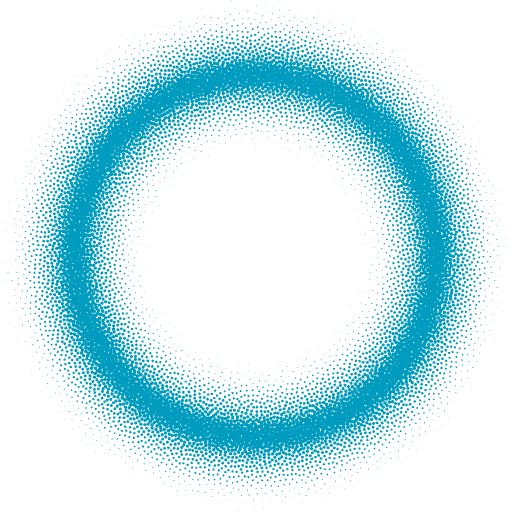

# Orion — AI Infrastructure Control

<div align="center">
  
</div>

## Overview

**Orion** adalah platform **AI-powered infrastructure control** yang membantu engineer menganalisis, memahami, dan mengeksekusi perintah sistem dengan lebih aman.

Alih-alih langsung menjalankan command berisiko, Orion memberikan:

- Analisis dampak
- Estimasi durasi & resource
- Risk level
- Safety warning sebelum eksekusi

## Core Concept

> _"Orion tidak menggantikan engineer — Orion memperkuat decision-making mereka."_

Orion bekerja sebagai **layer intelligence** di atas command line:

- Mengerti command
- Mengevaluasi risiko
- Memberikan konteks sebelum eksekusi

## Safety System (Updated)

Orion memiliki sistem deteksi command berbahaya berbasis pattern:

### 🔴 Critical (System Destruction)

Contoh:

- `rm -rf /`
- `dd if=/dev/zero of=/dev/sda`
- `:(){ :|:& };:` (fork bomb)

Dampak:

- Kehilangan seluruh sistem
- Tidak bisa recovery tanpa backup

### 🟠 Warning (High Risk)

Contoh:

- `rm -rf`
- `docker system prune -a`
- `kubectl delete`
- `curl | sh`

Dampak:

- Data loss
- Service disruption
- Security risk

### 🟢 Safe

Contoh:

- `ls -la`
- monitoring commands

## AI Command Analysis (Enhanced)

Setiap command dianalisis dengan informasi:

- **Impacts** → apa yang terjadi
- **Duration** → estimasi waktu
- **Space Impact** → penggunaan disk
- **Risk Level** → Low / Medium / High / Critical

Contoh:

```bash
docker system prune -a
```

Output analisis:

- Menghapus unused images
- Reclaim ~4.8GB disk
- Build berikutnya lebih lambat
- Risk: Medium

## Features

- **AI Command Analysis** (real-time)
- **Dangerous Command Detection**
- **Dry-Run Simulation**
- **Quick Prompts (pre-built scenarios)**
- **Chat-based Infrastructure Control**
- **Real-time Metrics (CPU, RAM, Uptime)**
- **Dark / Light Mode**

## Quick Prompts System

Orion menyediakan preset untuk use case umum:

- Analisis kode
- Perintah terminal
- Operasi file system
- System service control

Contoh:

```bash
sudo systemctl restart nginx
```

Orion akan menjelaskan:

- potensi downtime
- dampak ke user
- best practice sebelum eksekusi

## Architecture

Orion menggunakan pendekatan:

### Atomic Design

- **Atoms** → komponen kecil (button, pill, input)
- **Molecules** → gabungan atoms
- **Organisms** → layout kompleks

### AI Layer

- Pattern-based detection (`DANGEROUS_COMMANDS`)
- Context-aware analysis (`ANALYSIS_DATABASE`)
- Predefined intelligent responses (`QUICK_PROMPTS`, `CHAT_SUGGESTIONS`)

## Project Structure

```
src/
├── app/
├── components/
│   ├── atoms/
│   ├── molecules/
│   └── ...
├── hooks/
├── provider/
├── types/
└── lib/
```

## Tech Stack

| Teknologi    | Kegunaan         |
| ------------ | ---------------- |
| Next.js 16   | Framework utama  |
| TypeScript   | Type safety      |
| Tailwind CSS | Styling          |
| next-themes  | Theme management |
| Lucide React | Icons            |

## Getting Started

### Install

```bash

Menggunakan npm

git clone https://github.com/hanifakbari/orion.git
cd orion
npm install

Menggunakan yarn

git clone https://github.com/hanifakbari/orion.git
cd orion
yarn install
```

### Run

```bash
npm
npm run dev

yarn
yarn dev

```

Buka: http://localhost:3000

## Build Production

```bash
npm

npm run build
npm start

yarn

yarn build
yarn start
```
